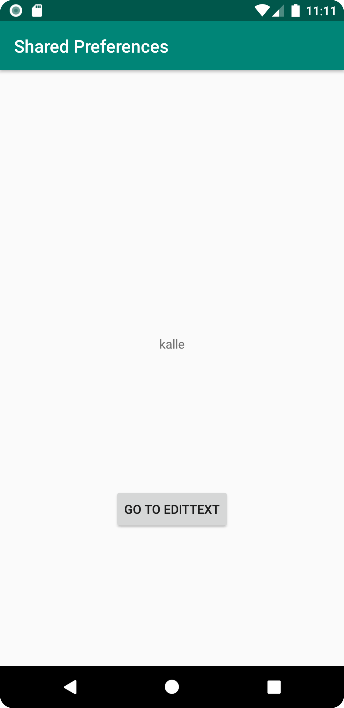
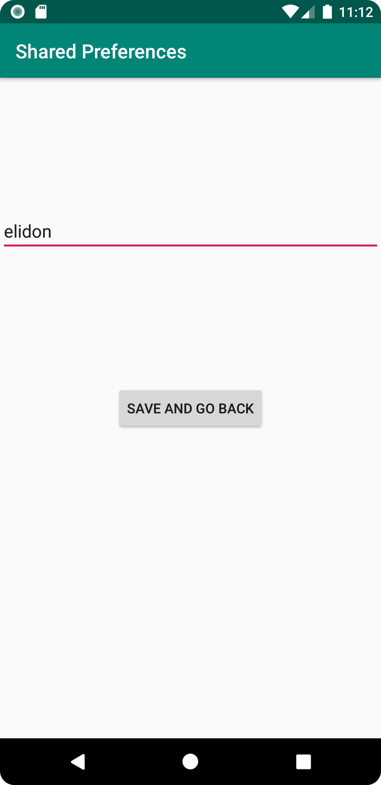
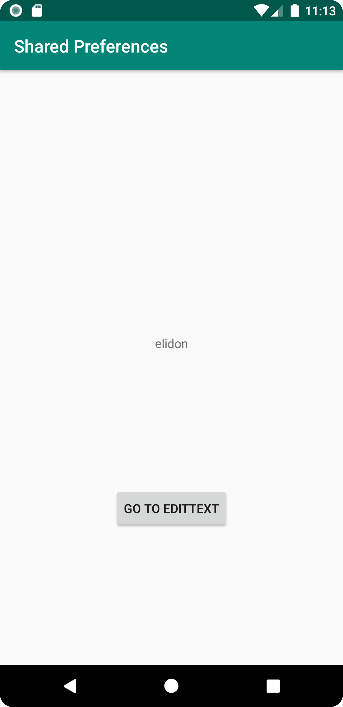

# Rapport

Skapat 2 aktiviteter (enligt uppgiftsbeskrivning)
och lagt till intents för att gå fram och tillbaka genom knappar 
(har ej använt onReturn som tipsades, stannade med onCreate).
Även lagt till delad (från lenaSYS) kod för att utnyttja SharedPreferences
för att få text att visas inom en TextView på MainActivity 
vid knapptryck på SecondActivity ifrån en EditText ifrån SecondActivity.

Kod bitar:

```
MainActivity
ENDAST RELEVANT KOD (SharedPreferences) VISAS

    private SharedPreferences myPreferenceRef;
    private SharedPreferences.Editor myPreferenceEditor;
    @Override
    protected void onCreate(Bundle savedInstanceState) {
        super.onCreate(savedInstanceState);
        setContentView(R.layout.activity_main);
        Toolbar toolbar = findViewById(R.id.toolbar);
        setSupportActionBar(toolbar);

        myPreferenceRef = getSharedPreferences("MyPreferencesName", MODE_PRIVATE);
        myPreferenceEditor = myPreferenceRef.edit();

        TextView prefTextRef=new TextView(this);
        prefTextRef=(TextView)findViewById(R.id.prefText);
        prefTextRef.setText(myPreferenceRef.getString("MyAppPreferenceString", "No preference found."));

        goToSecondActivity();
    }

}
```

```
SecondActivity
ENDAST RELEVANT KOD (SharedPreferences + savePref) VISAS

    protected void onCreate(Bundle savedInstanceState) {

        myPreferenceRef = getSharedPreferences("MyPreferencesName", MODE_PRIVATE);
        myPreferenceEditor = myPreferenceRef.edit();
        super.onCreate(savedInstanceState);
        setContentView(R.layout.activity_second);
    }
    
    public void savePref(View v){
        EditText newPrefText=new EditText(this);
        newPrefText=(EditText)findViewById(R.id.settingseditview);

        myPreferenceEditor.putString("MyAppPreferenceString", newPrefText.getText().toString());
        myPreferenceEditor.apply();

        newPrefText.setText("");

        Intent intent = new Intent(SecondActivity.this, MainActivity.class);
        startActivity(intent);
    }
```

Bilder

Bild 1 (innan "delning" av text):


Bild 2 (text som kommer "delas""):


Bild 3 (MainActivity visar shared preference):
